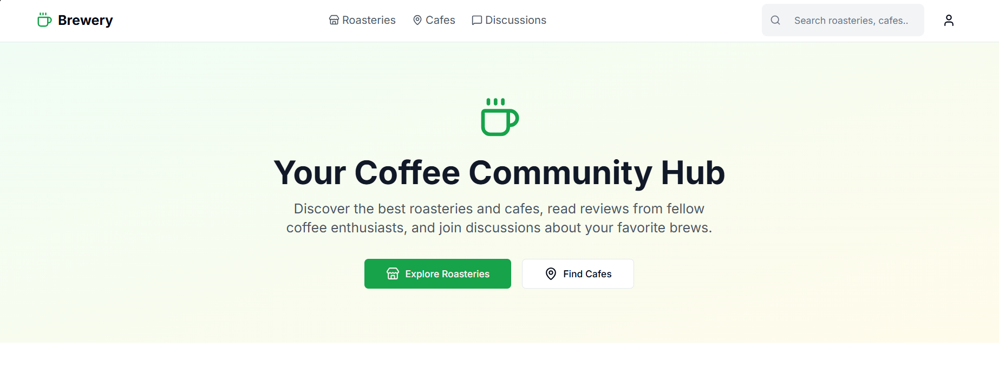
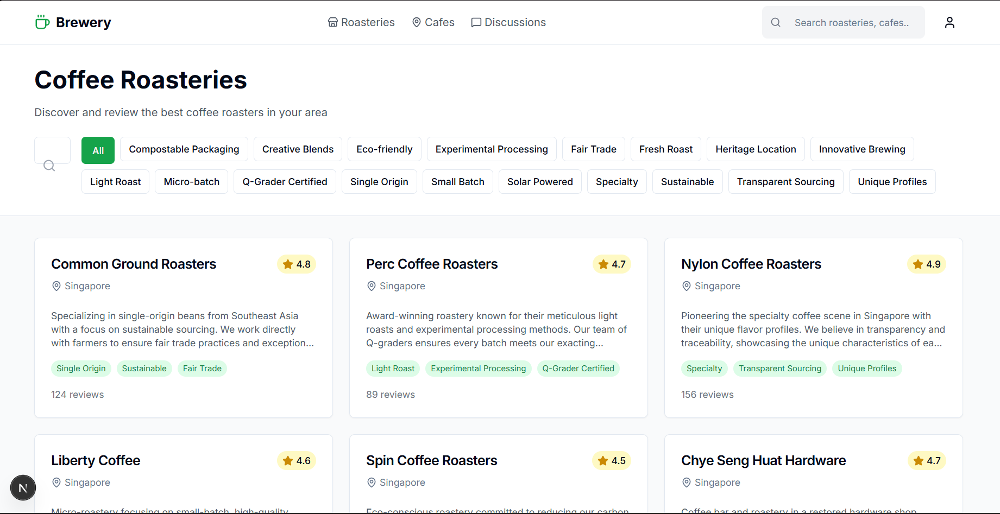
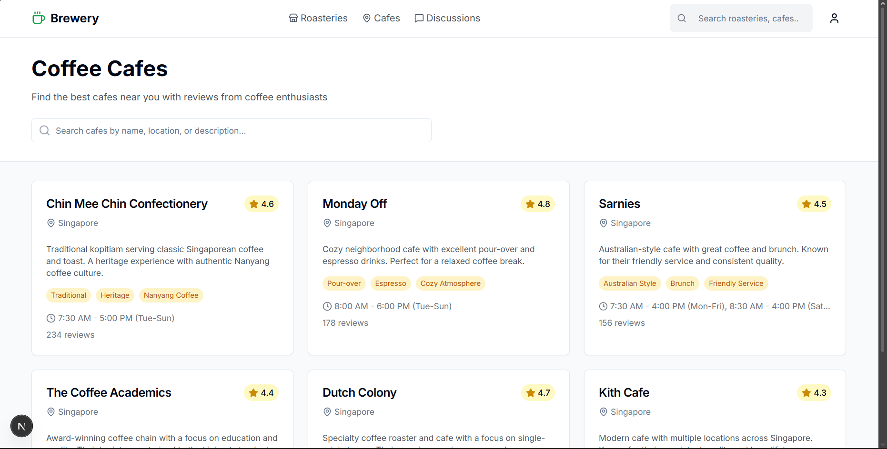
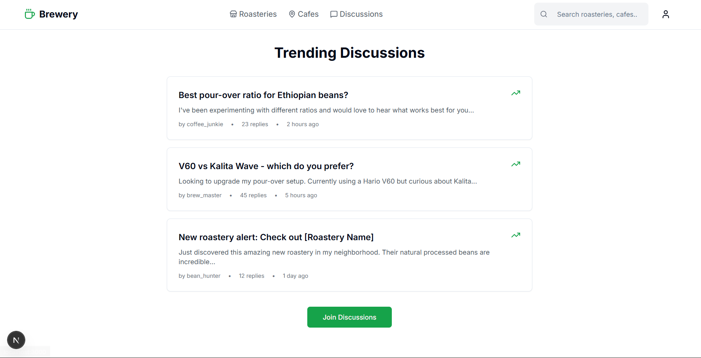

# ☕ Brewery

**Your centralized hub for discovering coffee roasteries, cafes, and connecting with fellow coffee enthusiasts.**

Tired of hunting across Google, roastery websites, and Shopee to find good coffee? Brewery brings everything together in one place - like Shopee, but dedicated entirely to coffee.

## 🎯 Mission

We believe every coffee lover deserves easy access to quality coffee information. Whether you're a home brewer looking for the perfect beans, a cafe hopper seeking your next favorite spot, or a coffee enthusiast wanting to share knowledge - Brewery is for you.

## ✨ Features

### 🔍 Roastery Discovery
- Browse and discover local and international coffee roasteries
- Read detailed profiles with specialties, processing methods, and flavor notes
- Community-driven reviews and ratings
- Filter by specialty (Single Origin, Sustainable, Fair Trade, etc.)

### 🏪 Cafe Recommendations
- Find the best cafes near you with honest community reviews
- View cafe specialties, hours, and contact information
- Filter by atmosphere, brewing methods, and more
- Contribute your own cafe experiences

### 💬 Community Discussions
- Join vibrant discussions about brewing methods, bean origins, and equipment
- Share knowledge with fellow coffee enthusiasts
- Get advice from experienced baristas and home brewers
- Topics range from beginner tips to advanced techniques

### 🔐 User Authentication
- Sign up and login functionality with Supabase
- Secure authentication with Row Level Security (RLS)
- Protected routes (homepage requires authentication)
- User greeting and profile link in navigation when logged in

### 👤 User Profiles
- View your activity stats (reviews, discussions, replies)
- See your submitted reviews, discussions, and replies
- Account management and logout functionality

### 📝 Content Submission
- Submit reviews for roasteries and cafes
- Create new discussion topics with category and tag selectors
- Reply to community discussions
- Edit and delete your own discussions
- All content stored in Supabase database

### 🔍 Advanced Search & Filters
- Filter roasteries and cafes by specialty
- Filter by minimum rating (1-5 stars)
- Sort by newest, highest rated, or most reviews
- Filter discussions by category
- Sort discussions by newest, most replies, or most likes
- Expandable filter panels for better UX

### 🛒 Coming Soon
- Coffee bean marketplace with direct roastery purchases
- Equipment reviews and recommendations
- Brewing method guides and tutorials
- Image upload functionality

### 🗺️ Google Maps Integration (Future)
- Search and add cafes/roasteries via Google Places API
- Auto-populate submission forms with Google Maps data
- Source attribution (Google Places, manual entry, etc.)
- Access to Google's photos and location data
- Enhanced data accuracy and faster entry

## 🚀 Tech Stack

- **Next.js 16.2.3** - React framework with App Router
- **React 19.2.5** - UI library
- **TypeScript 6.0.2** - Type safety
- **TailwindCSS 3** - Utility-first CSS framework
- **shadcn/ui** - Beautiful, accessible UI components
- **Lucide React** - Icon library
- **Supabase** - Backend as a Service (database, auth, storage)

## 📸 Screenshots






## 🏃 Getting Started

### Prerequisites
- Node.js 18+ installed
- npm or yarn package manager

### Installation

```bash
# Clone the repository
git clone https://github.com/yourusername/brewery.git
cd brewery

# Install dependencies
npm install

# Start the development server
npm run dev
```

Open [http://localhost:3000](http://localhost:3000) to view the app.

## 🤝 Contributing

We welcome contributions from coffee enthusiasts of all levels! Here's how you can help:

### Easy Contributions (Great for Beginners!)
- **Add your favorite roastery or cafe** - Simply edit `data-contribution.json` with the details and submit a PR
- **Fix typos** - Spot a spelling mistake? Fix it!
- **Improve documentation** - Help make our README clearer

### Code Contributions
- **Build new features** - Check our roadmap for planned features
- **Fix bugs** - Help squash issues in the issue tracker
- **Improve UI/UX** - Make the app more beautiful and user-friendly
- **Add tests** - Help us ensure code quality

### How to Contribute

1. Fork the repository
2. Create a feature branch (`git checkout -b feature/amazing-feature`)
3. Commit your changes (`git commit -m 'Add amazing feature'`)
4. Push to the branch (`git push origin feature/amazing-feature`)
5. Open a Pull Request

**Want to see your favorite roastery on the site? Submit a PR adding it to `data-contribution.json`!**

## 📋 Project Structure

```
brewery/
├── src/
│   ├── app/              # Next.js App Router pages
│   │   ├── login/        # Login page
│   │   ├── signup/       # Signup page
│   │   ├── profile/      # User profile page
│   │   ├── roasteries/   # Roastery listing and detail pages
│   │   ├── cafes/        # Cafe listing and detail pages
│   │   └── discussions/  # Discussion forum
│   ├── components/       # Reusable UI components
│   ├── lib/             # Utility functions, auth context, and Supabase client
│   └── types/           # TypeScript type definitions
├── data-contribution.json # Community contribution data
├── screenshots/          # App screenshots
└── README.md
```

## 🗺️ Roadmap

### Completed ✅
- [x] User authentication system with Supabase
- [x] User profile pages with profile picture upload
- [x] Content submission (reviews, discussions, replies)
- [x] Database integration with Supabase
- [x] Advanced search and filters (specialty, rating, sorting)
- [x] Discussion edit and delete functionality
- [x] Category and tag selectors in discussion form
- [x] Image upload functionality (discussions, reviews, roasteries, cafes, profile pictures)
- [x] Roastery/cafe submission forms with image upload
- [x] User roles (admin, moderator, user)
- [x] Admin dashboard
- [x] Role-based permissions throughout the app
- [x] Reply functionality (edit, delete, like)
- [x] Unique view count tracking per user

### In Progress 🚧
- [ ] Coffee bean marketplace

### Planned 📋
- [ ] Equipment reviews and ratings
- [ ] Brewing method guides
- [ ] Google Maps Integration (search and add cafes/roasteries via Google Places API)
- [ ] Matcha expansion (matcha brands, products, reviews)
- [ ] Mobile app
- [ ] Internationalization support

## 🌟 Why Contribute?

- **Impact** - Help thousands of coffee lovers discover great coffee
- **Learn** - Gain experience with modern web technologies
- **Community** - Join a passionate community of coffee enthusiasts
- **Portfolio** - Build your open source contribution history
- **Fun** - Work on something you're passionate about!

## 📝 License

ISC

## 📧 Contact

Have questions or suggestions? Open an issue or reach out to us.

Discord @arrz.ryn

---

**Built with ❤️ by coffee enthusiasts, for coffee enthusiasts**
